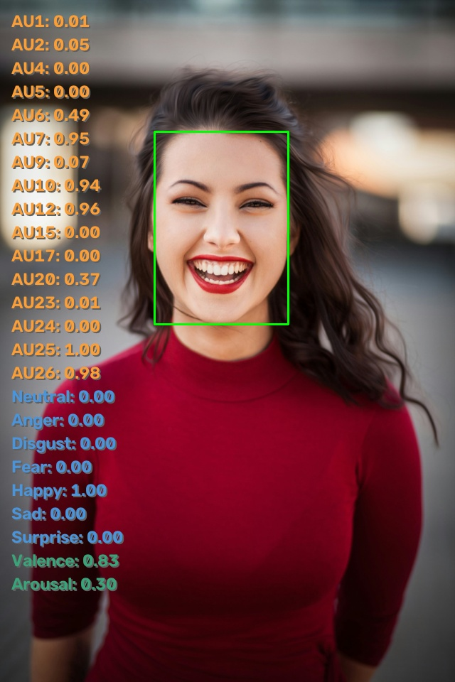

# SeetaPsych Emo

> SeetaPsych 面部情感 / 情绪识别模块集合。

简体中文 | [English](README.md)

[](pyproject.toml)
[](LICENSE)

## 使用说明

本项目已包含在 seetapsych-lib 的默认配置中。通过 `seetapsych-manager download` 即可下载并使用。

具体用法参见 [SeetaPsych](https://github.com/seetapsych/seetapsych-lib)。

也可通过以下方式额外加载本算法模块。

### WebUI

运行 `seetapsych-webui` 时使用 `--files` 参数加载：

```
seetapsych-webui --files seetapsych_emo/modules/emonet.yml
```

### 编程使用

在程序中添加以下代码以使用本算法模块：

```python
from seetapsych_lib.runtime.factory import Factory
from seetapsych_lib.runtime.pipeline import Pipeline

factory = Factory()
factory.load_file_modules("seetapsych_emo/modules/emonet.yml")

pipeline = Pipeline(factory, ...)

pipeline.add_attributes("face/expression", "face/action_units", "face/dimensional_affect")
```

完整的端到端示例（含可视化）参见 [examples/image_emonet.py](examples/image_emonet.py)。

### 模块目录

| YAML 路径 | 算法包 |
|---|---|
| [emonet.yml](seetapsych_emo/modules/emonet.yml) | Emotions-SeetaEmoNet |

### SeetaEmoNet

多任务面部情感估计：动作单元（Action Units）、分类表情、连续效价-唤醒（valence-arousal）维度。

<div align="center" id="figure-emonet-result">
  
  <p><em><strong>图 1</strong> SeetaEmoNet 输出可视化 — 预测得到的动作单元、表情与效价-唤醒维度。</em></p>
</div>

模块配置：[emonet.yml](seetapsych_emo/modules/emonet.yml)

| 算法包名称 | 提供属性 | 依赖属性 |
|---|---|---|
| Emotions-SeetaEmoNet | `face/action_units`, `face/expression`, `face/dimensional_affect` | `face/landmarks` |

**说明**：统一的多任务 MAE-ViT 模型，从 5 点对齐的人脸裁剪图中同时预测 16 个动作单元、7 种表情以及效价-唤醒维度。

**参数**：*(无)*

**模型**

| 名称 | 推荐 |
|---|---|
| seeta-emo-ufanet-2604.safetensors | ✓ |

**输出属性**
- `face/action_units` — [规格](https://github.com/seetapsych/seetapsych-attributes#faceaction_units)。
- `face/expression` — [规格](https://github.com/seetapsych/seetapsych-attributes#faceexpression)。
- `face/dimensional_affect` — [规格](https://github.com/seetapsych/seetapsych-attributes#facedimensional_affect)。

**输出细节**：
- `face/expression`：7 类基本表情及置信度 — neutral（中性）、anger（愤怒）、disgust（厌恶）、fear（恐惧）、happy（高兴）、sad（悲伤）、surprise（惊讶）。
- `face/action_units`：16 个面部动作单元及强度 — AU1、AU2、AU4、AU5、AU6、AU7、AU9、AU10、AU12、AU15、AU17、AU20、AU23、AU24、AU25、AU26。
- `face/dimensional_affect`：连续效价与唤醒值，以字典 `{valence: float, arousal: float}` 形式给出。
